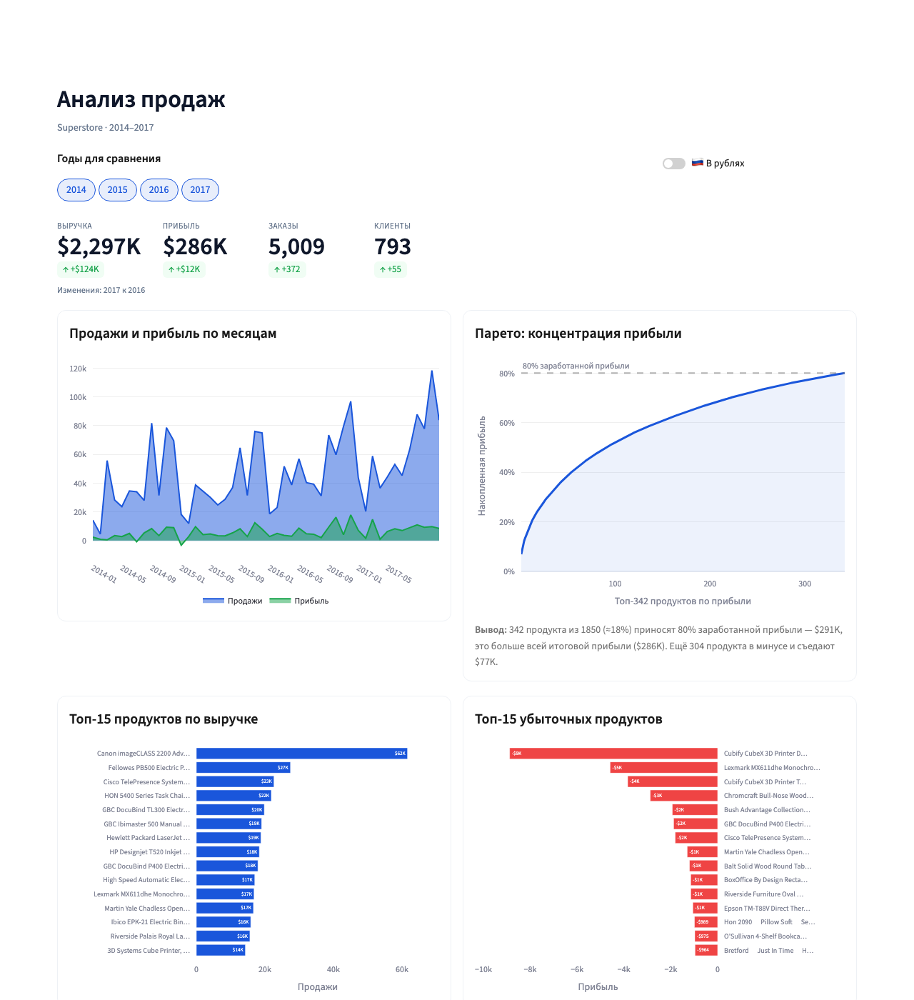
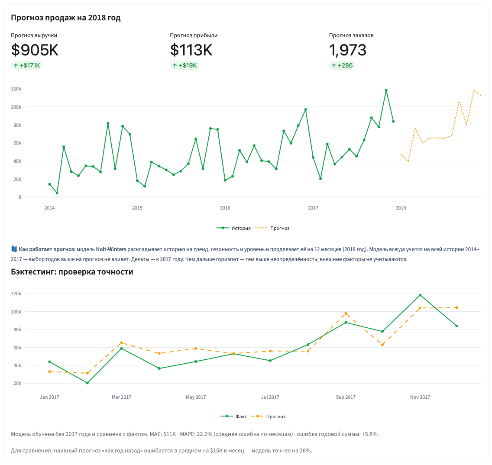
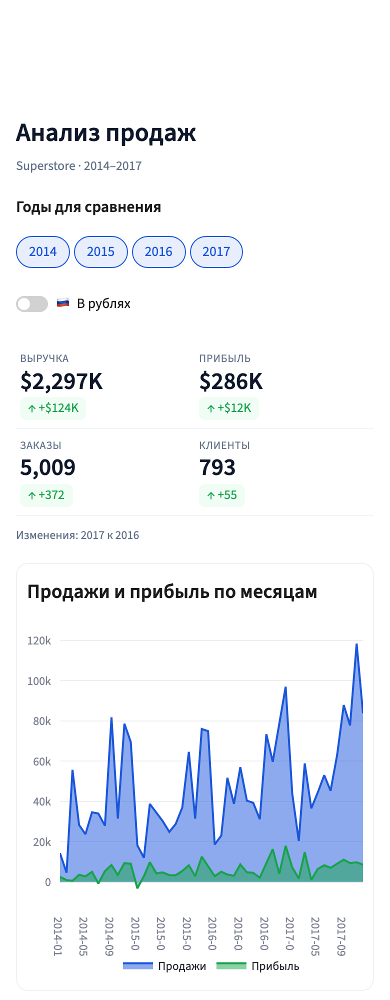

# Superstore BI — анализ продаж ритейлера

Интерактивный дашборд: где сеть зарабатывает, где теряет прибыль и сколько продаст в следующем году.
Данные — 9 994 строки заказов (5 009 заказов, 793 клиента), США, 2014–2017.

**[Открыть дашборд](https://superstore-bi-v2-6glc2tg9adbvjzdgdamld5.streamlit.app)** · Python · pandas · Plotly · Streamlit · statsmodels · pytest



## Главные выводы (все годы)

- Выручка **$2,30 млн**, прибыль **$286K**, маржа **12,5%**. Рост: 2016 **+29,5%**, 2017 **+20,4%**.
- **Скидки от 30% убыточны:** это 16% выручки, но **−$135K прибыли — минус 47% итоговой прибыли**.
- **342 продукта из 1850 (18%) приносят 80% заработанной прибыли** — $291K, больше всей
  итоговой прибыли ($286K). Ещё 304 продукта в минусе и съедают $77K.
- Мебель (Furniture) почти не зарабатывает — маржа ~2%; главный убыток — столы (Tables, −$17,7K).
- Прогноз на 2018 год — **около $0,9 млн (+23–25%)**. На 2017 годе модель ошиблась в годовой сумме
  на +5,8% и оказалась на 26% точнее наивного прогноза «как год назад».

Все выводы в дашборде пересчитываются из данных при смене годов и валюты.

## Что сделано

- **Дашборд из 10 блоков:** динамика, концентрация прибыли (Парето), лидеры и убыточные товары,
  скидки, клиенты, структура категорий, география, прогноз, экспорт в CSV/Excel.
- **Авто-выводы** под графиками формируются из данных, а не пишутся вручную.
- **Прогноз с проверкой:** Holt-Winters на 12 месяцев; бэктест на отложенном годе и сравнение
  с наивной моделью.
- **Рубли по курсу ЦБ на дату каждого заказа** — официальные дневные курсы, без запросов в сеть.
- **Мобильная версия:** KPI в две колонки, статичные графики, которые не мешают прокрутке.
- **Инженерия:** расчёты отделены от интерфейса, 38 автотестов, закреплённые версии библиотек.

<p>
  
  
</p>

## Как считается

| Показатель | Как |
|---|---|
| KPI | Сумма за выбранные годы. Дельты — последний выбранный год к предпоследнему (подписано под KPI) |
| Парето | Только прибыльные продукты, накопленная доля их прибыли; `n80` — первый продукт, на котором набирается 80% |
| Скидки | Группы по размеру скидки, рентабельность = прибыль / выручка группы |
| Рубли | Каждый заказ — по курсу ЦБ на дату заказа (последний установленный). Курсы лежат в файле, приложение в сеть не ходит |
| Прогноз | Holt-Winters (аддитивные тренд и сезонность, период 12), всегда на полной истории в $. Прибыль = выручка × историческая маржа, заказы = выручка / средний чек |
| Бэктест | Модель учится без последнего года и сравнивается с фактом и с наивным «как год назад» (MAE, MAPE, ошибка годовой суммы) |

## Запуск

```bash
python3 -m venv .venv
.venv/bin/pip install -r requirements-dev.txt
.venv/bin/streamlit run app.py
```

Тесты (38 шт.: расчёты, прогноз, страница целиком на разных наборах годов):

```bash
.venv/bin/python -m pytest
```

## Развёртывание

Приложение развёрнуто на Streamlit Community Cloud (https://superstore-bi-v2-6glc2tg9adbvjzdgdamld5.streamlit.app) и пересобирается само
при каждом пуше в `main`. Развернуть заново: share.streamlit.io → **Create app** → репозиторий `kireevsaratov-stack/superstore-bi-v2`, ветка `main`, файл `app.py`,
в Advanced settings — **Python 3.12** (нужен ≥ 3.11: версии закреплены в `requirements.txt`).

## Структура

```
app.py                  раскладка страницы: какие блоки, в каком порядке
superstore/
  config.py             пути, цвета, настройки графиков
  data.py               загрузка CSV, курсы ЦБ, пересчёт в рубли, экспорт
  analytics.py          расчёты блоков и тексты авто-выводов
  forecast.py           прогноз Holt-Winters и бэктест
  charts.py             Plotly-фигуры
  ui.py                 CSS, KPI, карточки (единственный модуль со Streamlit)
  formatting.py         $1,235K, склонения
data/
  Sample - Superstore.csv   исходные данные (9994 строки заказов, 5009 заказов)
  usd_rub_cbr.csv           дневные курсы ЦБ USD/RUB за 12.2013–12.2017
scripts/fetch_cbr_rates.py  обновление файла курсов (официальный API ЦБ)
tests/                  pytest
docs/                   история изменений, скриншоты
```

## Данные

- **Superstore** — учебный датасет розничных продаж (Tableau Sample Superstore).
- **Курсы USD/RUB** — официальный API Банка России (`XML_dynamic`, код валюты R01235).
